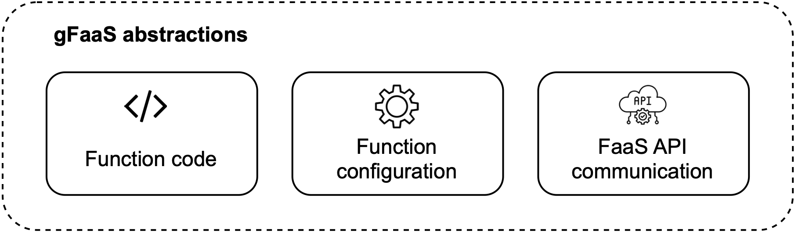
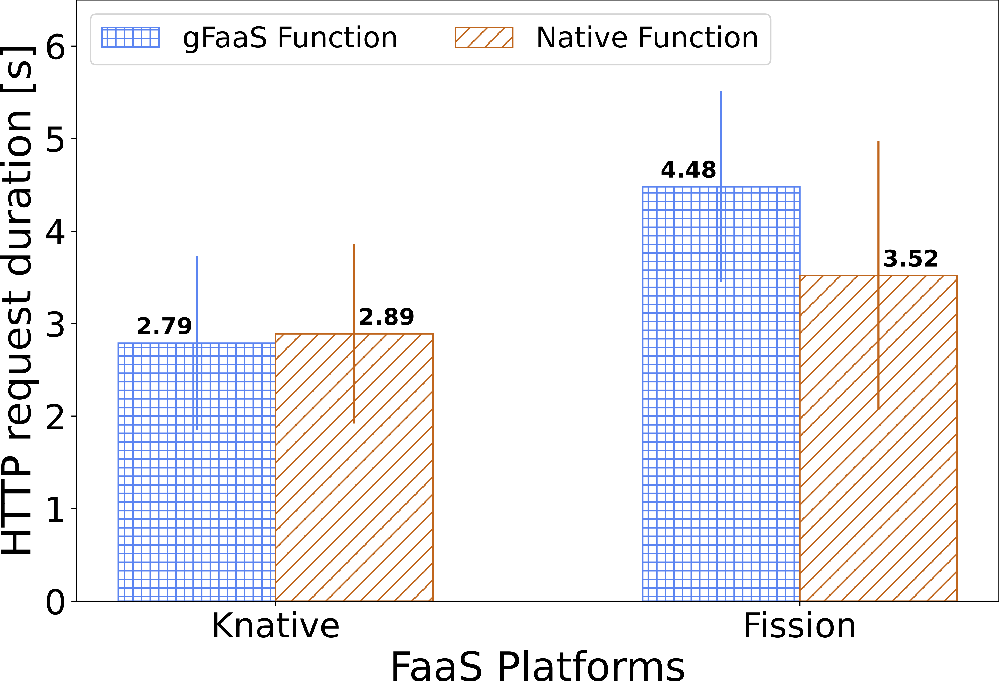
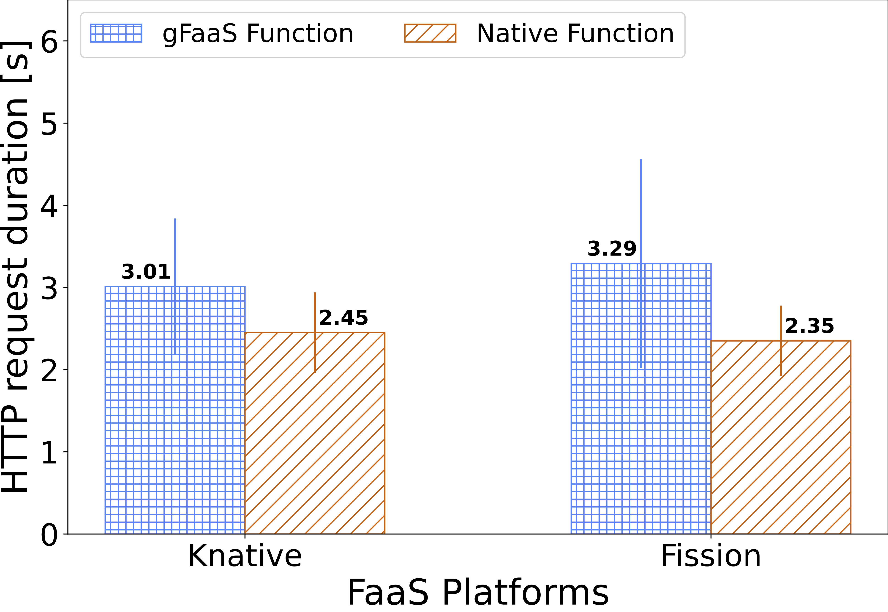
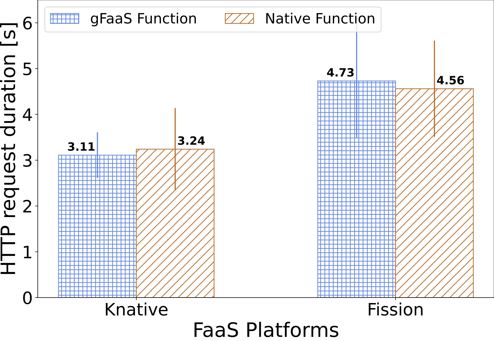
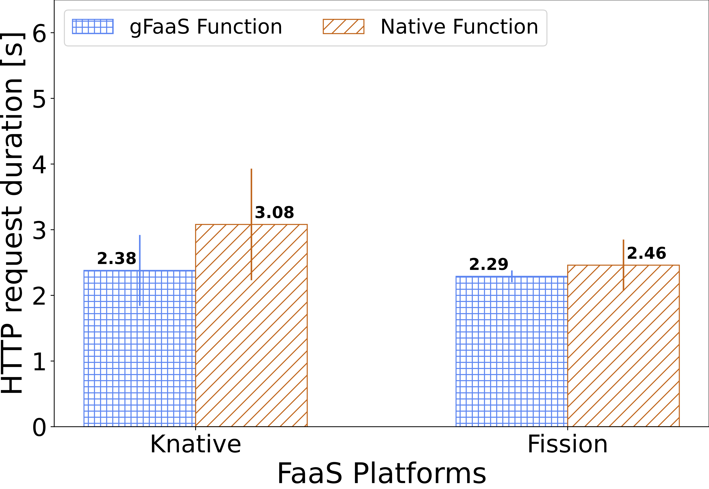
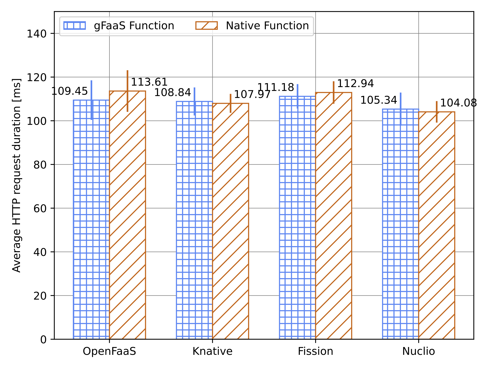
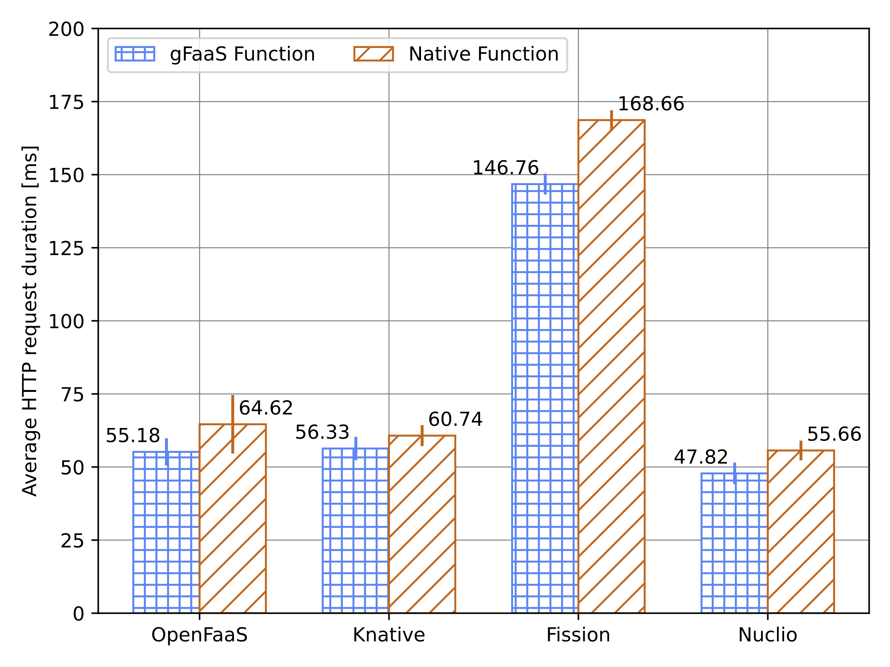
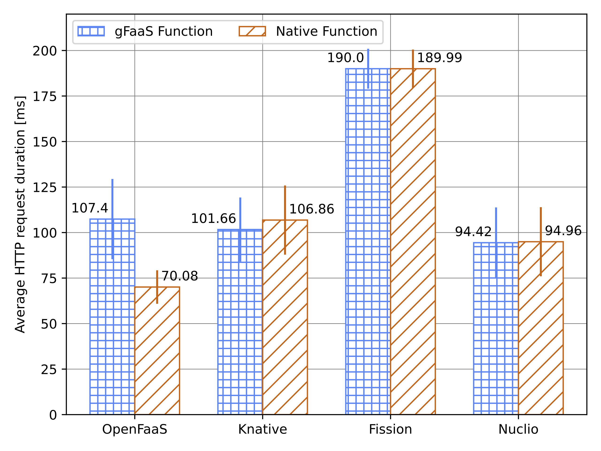
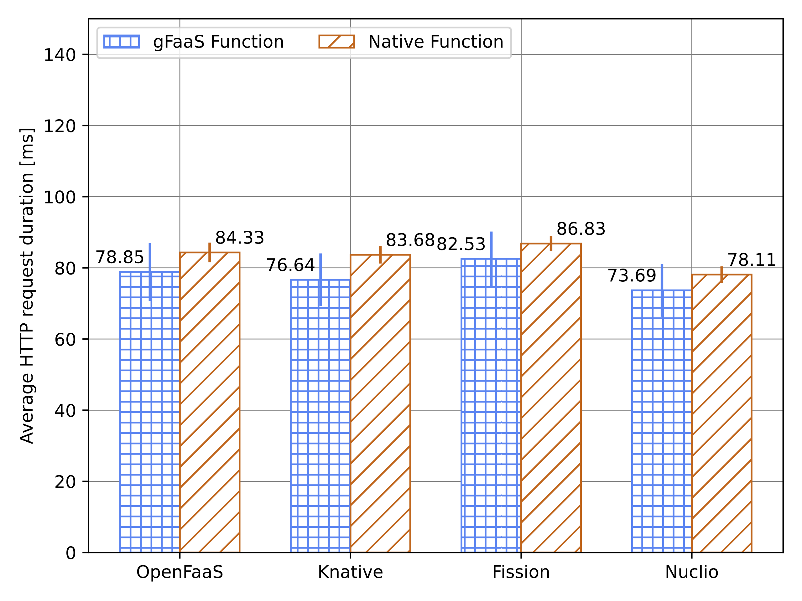

# gFaaS
gFaaS is a novel framework that facilitates the holistic development and management of functions across diverse FaaS platforms. It enables the development of generic functions in multiple programming languages that can be seamlessly deployed across different platforms without modifications. 

## Areas of the abstraction
To achieve its design goals and enable generic functions, gFaaS provides an abstraction layer for the function code, function configuration, and interaction with the FaaS plaforms as shown in the figure below.

## Features

### FaaS Platforms
gFaaS currently supports the following FaaS plaforms:

1. [Knative](https://github.com/knative/serving)
2. [Fission](https://github.com/fission/fission)
3. [Nuclio](https://github.com/nuclio/nuclio)
4. [OpenFaaS](https://github.com/openfaas/faas)  

### Programming
gFaaS currently supports the development of functions in `Python, Node.js, C++, Go, and Java`. The different language templates can be found at this [repository](https://github.com/paul-wie/gfaas-templates/tree/main). More templates can be easily integerated into our framework.

### gRPC
gFaaS supports the development of functions with gRPC support for Knative. For instruction, please see [here](./README.md).

### Migrating legacy code to gFaaS
gFaaS utilizes the adapter pattern to enable the migration of legacy code to our framework without code modifcations. For details, please read the Adapter section in the provided [templates](https://github.com/paul-wie/gfaas-templates/tree/main/function-python3.9).

## QuickStart
For quickly using gFaaS, you can use our docker image as below:
    
    docker pull kkyfury/gfaas-cli:v1
    docker run --rm kkyfury/gfaas-cli:v1 --version

The detailed functionality provided by gFaaS can be found [here](./gfaas-cli/README.md).

### Setting up the individual FaaS platforms
We also provide Terraform and Ansible files that we used to automate the deployment and configuration of the individual FaaS platforms on OpenStack VMs. This can be found [here](./infrastructure/cluster_setup/README.md) and adapted for distinct setups.

### Platform configuration
To run gFaaS with the supported FaaS platforms, you need to provide a configuration file in YAML. An example can be found [here](./gfaas-cli/resources/platform_settings.yml).

### Function configuration
To deploy and manage functions with gFaaS, you need to provide a function configuration file in YAML.  An example can be found [here](./gfaas-cli/resources/function.yml).

## System Design
The figure below shows the detailed system components within gFaaS and their interactions with external components to enable the holistic development and management of functions.

## Overhead
Our framework performs similar to platform-native functions and does not incur any significant overhead.

### Cold Start performance
The cold start performance is only compared with Knative and Fission since scale-to-zero is not offered by the community editions of OpenFaaS and Nuclio. The different functions we used for testing can be found [here](./performance_testing/).

#### Go

#### Node.js

#### Python

#### Java

### Hot Start performance

#### Go

#### Node.js

#### Python

#### Java
