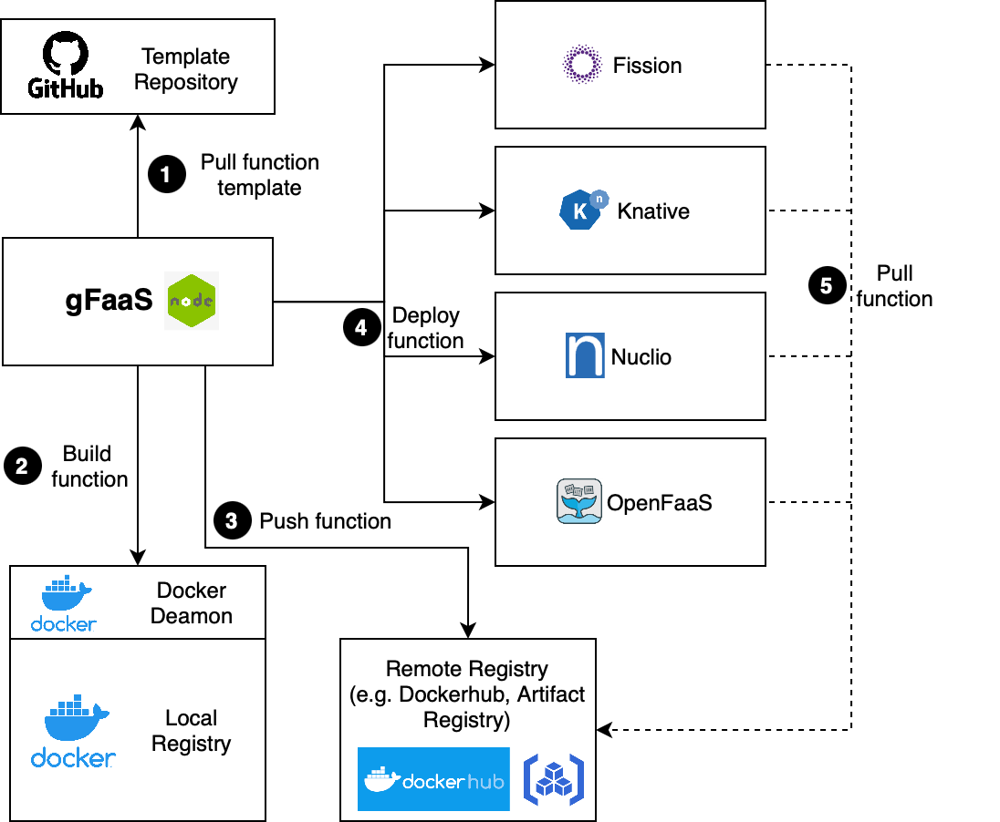

# gFaaS CLI

### Workflow


<!--  -->

###### Create functions
```
gfaas newFunction --lang $LANGUAGE
```

```LANGUAGE in {go1.19, python3.9, node14, java19, cpp20}```

The different language templates can be found at this [repository](https://github.com/paul-wie/gfaas-templates/tree/main).

###### Create functions with gRPC support
Currently these functions are only supported for Knative.

```
gfaas newFunction --lang $LANGUAGE
```

```LANGUAGE in {grpc-go1.19, grpc-python3.9, grpc-node14, grpc-java19, grpc-cpp20}```

###### Build function

```
gfaas build function.yaml
```

###### Push function

```
gfaas push function.yaml
```

###### Deploy function

```
gfaas deploy function.yaml $PLATFORM_ID
```

###### Delete function
```
gfaas delete function $FUNCTION_ID
```

###### Show function details
```
gfaas function $FUNCTION_ID
```

###### Show deployed functions
```
gfaas functions
```

###### Show available platforms
```
gfaas platforms
```

```
gfaas platforms --health
```

###### Integrate gFaaS into existing projects with adapt functionality
```
gfaas adapt --lang $LANGUAGE
```

```LANGUAGE in {go1.19, python3.9, node14, java19, cpp20}```


# CLI Development
### Build

```
npm run build
```

### Publish to npm

```
npm publish
```

### Development 

```
npm run start
```


### Install CLI

```
npm i gfaas -g
```

### Create executables

- Execute build-executables.sh to create executables for the different platforms. Make sure to install the necessary tools first.
```
npm i -g @vercel/ncc
```
```
ncc build index.ts -o dist
```
```
npm install -g pkg
```
```
cd dist && pkg index.js
```

### Create dockered CLI

```
docker build -t registry.hub.docker.com/<username>/gfaas-cli .
```

```
docker push registry.hub.docker.com/<username>/gfaas-cli
```
#### Run CLI command in docker

```
docker run --rm registry.hub.docker.com/<username>/gfaas-cli --version
```
